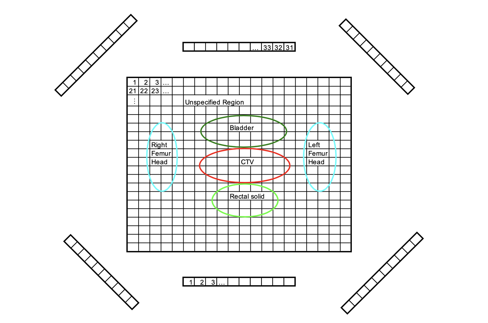
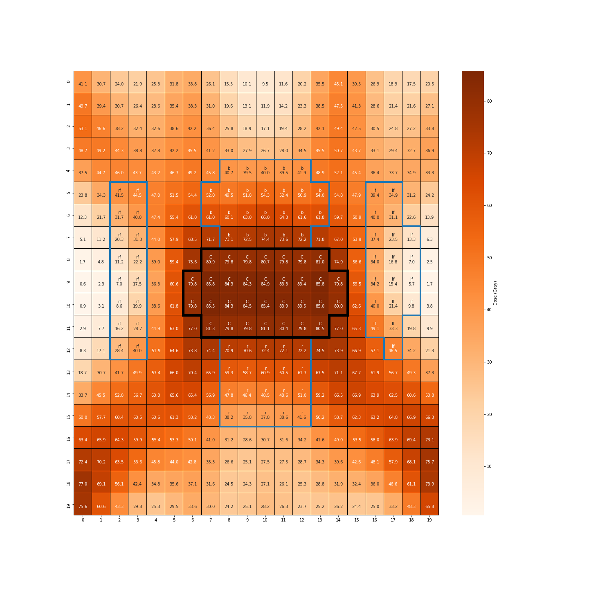

# IMRT Optimization for Cancer Treatment

## Introduction

[Intensity Modulated Radiation Therapy](https://en.wikipedia.org/wiki/Radiation_therapy#Intensity-modulated_radiation_therapy_(IMRT)) (IMRT) is an effective approach in cancer treatment. The main idea is to utilize beamlets to irradiate patients to kill tumor cells, while protecting healthy organs as much as possible. The treatment plan can be formulated as an optimization problem. This repository holds the solution to this optimization problem. One patient case is given in the following figure:

<b>The Cross Section</b>

The CTV (clinical target volume) is the target region. Surrounding the CTV are healthy structures: the bladder, left femur head, rectal solid, and right femur head. All voxels that are not contained in one of these structures are part of the "unspecified region." There are 6 beam angles, and each one consists of 10 beamlets, labeled anti-clockwise from 1 through 60 as shown in the figure.

## Contents

The report explains three different treatment plans as well as their formulations and trade-offs. The optimization problem is formulated and solved with [OR-Tools](https://developers.google.com/optimization) in Python.

The following figure shows one possible radiation intensity:

